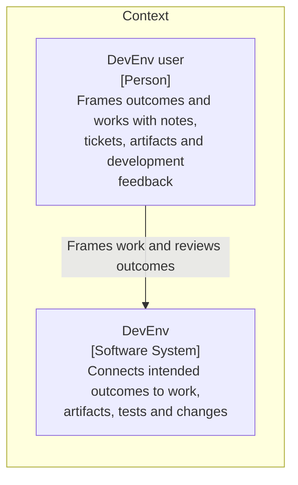
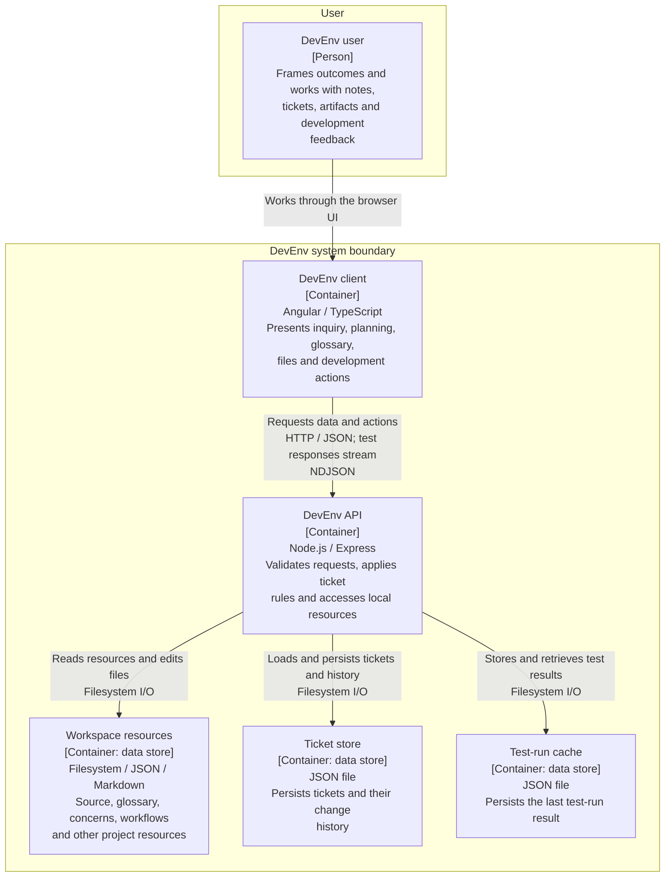
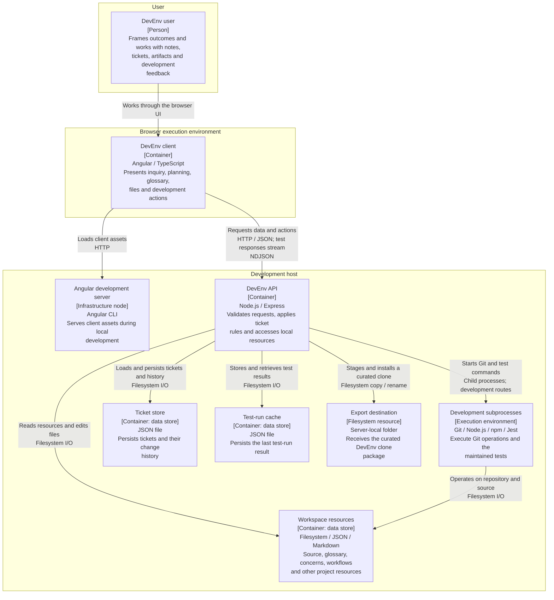

# DevEnv architecture

Generated from [devenv-c4.json](./devenv-c4.json). Do not edit independently. Regenerate using [devenv-c4.md](./devenv-c4.md).

Date: 2026-10-07. Current-architecture draft for review, not a proposed redesign.

Legend: boxes are labelled architectural elements; arrows are directed interactions; labelled groups show view-specific boundaries. Data-store containers do not imply separate processes.

## System context: DevEnv

No independent external application integration is established by the inspected paths. Git and test tooling appear in the deployment view; WMS examples are content, not a live integration.

## Containers: DevEnv

Filesystem stores are logical responsibilities, not separate services or necessarily separate disks. The shared package is a compile-time library, not a running container. Ticket persistence describes startServer; createApp defaults to an in-memory store.

## Deployment: local development

The browser may share the development host or be on another machine. The API defaults to port 3000. Export paths belong to the API machine. This does not specify production hosting, scaling or authentication guarantees.

## Limits

Selective source inspection, not runtime verification or a complete integration inventory. No component or dynamic diagrams yet. Mermaid flowcharts express C4-style views, not the experimental Mermaid C4 syntax.
